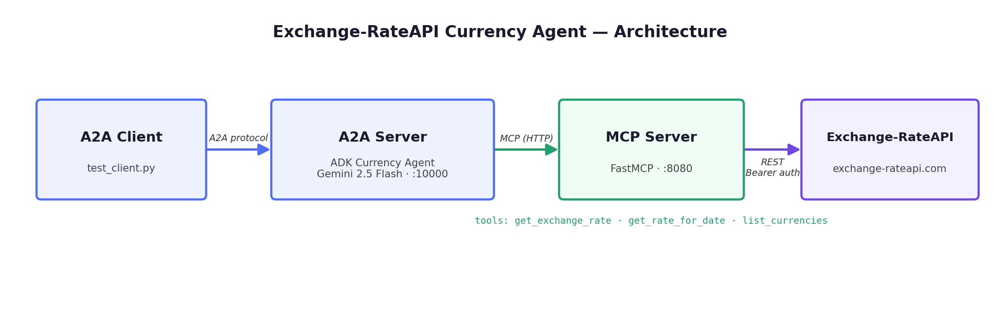

# 💶💱 Exchange-RateAPI Currency Agent (A2A + ADK + MCP)

[](https://github.com/Exchange-RateAPI/currency-agent/actions/workflows/ci.yml)
[](https://www.python.org/)
[](LICENSE)
[](https://exchange-rateapi.com)

A currency conversion AI agent demonstrating **A2A + ADK + MCP** working together, powered by the [Exchange-RateAPI](https://exchange-rateapi.com) exchange rate API.

It uses the **Agent2Agent (A2A) Python SDK** ([`a2a-sdk`](https://github.com/a2aproject/a2a-python)), Google's **Agent Development Kit** ([`google-adk`](https://github.com/google/adk-python)), and a [FastMCP](https://github.com/jlowin/fastmcp) server that exposes live, historical, and reference exchange rate data from Exchange-RateAPI.

## Overview



- **MCP Server** — exposes five tools backed by [exchange-rateapi.com](https://exchange-rateapi.com), with built-in response caching, timeouts, and retry with backoff:
  | Tool | Description |
  |---|---|
  | `get_exchange_rate` | Live exchange rate between two currencies, with optional amount conversion |
  | `compare_rates` | One base currency vs. several targets in a single API call |
  | `get_rate_for_date` | Exchange rate on a specific historical date (YYYY-MM-DD) |
  | `get_rate_change` | Trend over the last N days — start/end rate, change %, direction up/down |
  | `list_currencies` | All supported currency codes with full names |
- **ADK Agent** — orchestrates the conversation and invokes the MCP tools when needed.
- **A2A Server/Client** — advertises the agent over the Agent2Agent protocol so other agents can call it.
- **Multi-agent demo** — a second `travel_budget_agent` that delegates currency questions to the currency agent over A2A (see below).

## Getting Started

### Prerequisites

- Python 3.10+
- A **free Exchange-RateAPI key** — register at [exchange-rateapi.com/register](https://exchange-rateapi.com/register)
- A Google AI Studio API key (for the default Gemini model — see [Using other models](#using-other-models-claude-gpt-) for alternatives)

### Installation

1. Clone the repository:

```bash
git clone https://github.com/Exchange-RateAPI/currency-agent.git
cd currency-agent
```

2. Install [uv](https://docs.astral.sh/uv/getting-started/installation) (used to manage dependencies):

```bash
curl -LsSf https://astral.sh/uv/install.sh | sh
```

3. Configure environment variables:

```bash
cp .env.example .env
# then edit .env and set EXCHANGE_RATE_API_KEY and GOOGLE_API_KEY
```

### Run it (three terminals)

**Terminal 1 — MCP server:**

```bash
export $(grep -v '^#' .env | xargs)  # or rely on your shell env
uv run mcp-server/server.py
```

**Terminal 2 — A2A server (ADK agent):**

```bash
uv run uvicorn currency_agent.agent:a2a_app --host localhost --port 10000
```

**Terminal 3 — A2A client:**

```bash
uv run currency_agent/test_client.py
```

### Or run it with Docker Compose

```bash
EXCHANGE_RATE_API_KEY=era_live_... GOOGLE_API_KEY=... docker compose up --build
# then, in another terminal:
uv run currency_agent/test_client.py
```

### Example queries

- *"How much is 500 USD in LKR?"*
- *"Compare USD against EUR, GBP and JPY."*
- *"What was the USD/EUR rate on 2026-01-15?"*
- *"Is the euro up or down against the dollar this week?"*
- *"Which currencies do you support?"*

## Multi-agent demo (A2A in action) 🤝

`travel_agent/` contains a second agent — a **travel budget planner** — that has no
exchange-rate tools of its own. Whenever it needs a rate, it calls the currency agent
**over the A2A protocol**, which is the actual point of A2A: agents consuming other
agents as peers, not as bundled tools.

With Terminals 1 and 2 from above still running:

```bash
# Terminal 3 — travel agent (A2A server on port 10001)
uv run uvicorn travel_agent.agent:a2a_app --host localhost --port 10001

# Terminal 4 — ask it something
uv run travel_agent/test_client.py
# "I have 2000 USD for a 5-day trip to Japan. What is my total and daily budget in JPY?"
```

## Configuration

| Env var | Default | Description |
|---|---|---|
| `EXCHANGE_RATE_API_KEY` | — (required) | Your Exchange-RateAPI key |
| `GOOGLE_API_KEY` | — | Google AI Studio key (required for Gemini models) |
| `MODEL` | `gemini-2.5-flash` | Agent model — see below |
| `MCP_SERVER_URL` | `http://localhost:8080/mcp` | Where the agent finds the MCP server |
| `CURRENCY_AGENT_URL` | `http://localhost:10000` | Where the travel agent finds the currency agent |
| `EXCHANGE_RATE_API_BASE_URL` | `https://exchange-rateapi.com` | API base URL override |
| `PORT` | `8080` | MCP server port |

### Using other models (Claude, GPT, …)

Non-Gemini models are routed through [LiteLLM](https://github.com/BerriAI/litellm):

```bash
uv pip install litellm   # or: pip install 'exchange-rateapi-currency-agent[litellm]'
export MODEL=anthropic/claude-sonnet-4-6 ANTHROPIC_API_KEY=sk-ant-...
# or: export MODEL=openai/gpt-4o OPENAI_API_KEY=sk-...
```

## Development

```bash
uv pip install fastmcp==2.11.3 httpx pytest ruff
pytest          # unit tests (httpx mocked — no API key needed)
ruff check .    # lint
uv run mcp-server/test_server.py  # integration test against a running MCP server
```

CI runs lint + tests on every push (see badge above).

## Use the MCP server with Claude Desktop / Cursor instead

If you just want exchange rate tools in your MCP client (without ADK/A2A), use the production [Exchange-RateAPI MCP server](https://github.com/Exchange-RateAPI/mcp-server):

```json
{
  "mcpServers": {
    "exchange-rateapi": {
      "command": "npx",
      "args": ["-y", "@exchangerateapi/mcp-server"],
      "env": { "EXCHANGE_RATE_API_KEY": "era_live_..." }
    }
  }
}
```

## About Exchange-RateAPI

[Exchange-RateAPI](https://exchange-rateapi.com) is a fast, developer-friendly exchange rate API with live and historical rates, a generous free tier, and official SDKs for [JavaScript](https://github.com/Exchange-RateAPI/exchange-rateapi-js), [Python](https://github.com/Exchange-RateAPI/exchange-rateapi-python), [PHP](https://github.com/Exchange-RateAPI/exchange-rateapi-php), and [Rust](https://github.com/Exchange-RateAPI/exchange-rateapi-rust), plus an [MCP server](https://github.com/Exchange-RateAPI/mcp-server).

## Acknowledgements

Based on the excellent [jackwotherspoon/currency-agent](https://github.com/jackwotherspoon/currency-agent) sample (Apache 2.0), adapted to use Exchange-RateAPI.

## License

[MIT](LICENSE)
